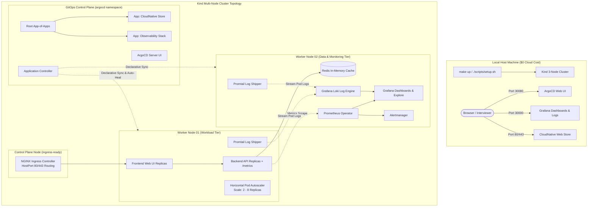

# Local Kubernetes Platform with GitOps & Observability
> **Reproducible multi-node Kubernetes platform running locally on Kind. Features automated GitOps delivery via ArgoCD (App-of-Apps pattern), end-to-end SRE observability (Prometheus Operator, Alertmanager, Grafana RED metrics dashboards), Horizontal Pod Autoscaling (HPA), and chaos engineering simulation scripts for live interview screen-shares.**

[](https://kubernetes.io/)
[](https://argo-cd.readthedocs.io/)
[](https://prometheus.io/)
[](https://grafana.com/)
[](https://grafana.com/oss/loki/)
[](LICENSE)
[](README.md)

---

## 📑 Table of Contents
- [Architecture & Platform Topology](#-architecture--platform-topology)
- [Why This Exists & Problem Solved](#-why-this-exists--problem-solved)
- [Quickstart: 1-Command Bootstrap (`make up`)](#-quickstart-1-command-bootstrap-make-up)
- [GitOps Architecture (ArgoCD App-of-Apps)](#-gitops-architecture-argocd-app-of-apps)
- [SRE Observability: Metrics (Prometheus) & Logs (Loki)](#-sre-observability-metrics-prometheus--logs-loki)
- [Chaos Engineering & Self-Healing Scenarios](#-chaos-engineering--self-healing-scenarios)
- [Live 5-Minute Interview Screen-Share Script](#-live-5-minute-interview-screen-share-script)
- [SRE Alerting Rules & Runbook](#-sre-alerting-rules--runbook)
- [Interview Deep-Dive & Architecture Trade-offs](#-interview-deep-dive--architecture-trade-offs)

---

## 🏛 Architecture & Platform Topology



---

## 🎯 Why This Exists & Problem Solved

Most junior Kubernetes projects only contain single-file toy manifests (`deployment.yaml`) applied imperatively via `kubectl apply`. In production enterprise environments, this fails because:
1. **Imperative Management Causes Configuration Drift:** Engineers editing clusters manually leads to untested, out-of-sync states across clusters.
2. **Missing Multi-Node Scheduling Realities:** Single-node setups cannot demonstrate pod anti-affinity, zone spread constraints, or worker node isolation.
3. **No SRE Feedback Loops:** Clusters without RED metrics or automated autoscaling (HPA) fail under real production traffic bursts.
4. **Siloed Metrics vs. Logs:** When alerts fire, engineers need correlated logs (Loki) right alongside time-series metrics (Prometheus) to diagnose root cause in seconds.

**This platform solves these challenges by providing:**
- **Reproducible Multi-Node Topology:** A 3-node cluster (1 control plane + 2 worker nodes) simulating real multi-zone cloud architecture locally on Docker.
- **Pure Declarative GitOps:** Managed entirely via ArgoCD using the enterprise **App-of-Apps pattern** with automated self-healing.
- **Turnkey SRE Observability (PLG Stack):** Pre-configured `kube-prometheus-stack` with Google Golden Signals / RED metrics dashboards, production Alertmanager rules, and **Loki + Promtail** distributed log aggregation.
- **Interactive Chaos Demonstrations:** Built-in scripts to simulate traffic surges, pod terminations, and error spikes live on screen-share.

---

## 🚀 Quickstart: 1-Command Bootstrap (`make up`)

### Prerequisites
- Docker Desktop or Docker Engine running
- `kind`, `kubectl`, and `helm` installed locally

### Spin Up Platform
```bash
# Clone the repository
git clone https://github.com/rahulmotvani0-sketch/kubernetes-gitops-observability-platform.git
cd kubernetes-gitops-observability-platform

# Bootstrap the complete platform (Kind, Ingress, ArgoCD, Apps, Prometheus, Loki, Grafana)
make up
```

### Access Platform Endpoints:
| Service | URL | Credentials | Purpose |
|:---|:---|:---|:---|
| **CloudNative Store Web** | `http://localhost/` | None | Public frontend UI |
| **Backend Health & API** | `http://localhost/api` | None | REST API exposing `/metrics` |
| **ArgoCD GitOps UI** | `http://localhost:30080` | `admin` / auto-generated | GitOps sync and health status |
| **Grafana SRE & Logs** | `http://localhost:30000` | `admin` / `admin` | Unified RED metrics & Loki logs |
| **Loki Log Ingester** | `http://localhost:3100` | None | Distributed container log engine |

---

## 🔄 GitOps Architecture (ArgoCD App-of-Apps)

The platform implements the industry-standard **App-of-Apps pattern**:

```
gitops/
├── argocd/
│   └── root-app.yaml            # Master Root Application
├── apps/
│   ├── workload-app.yaml        # Child App: CloudNative Store
│   └── observability-app.yaml   # Child App: Prometheus & Grafana Stack
└── manifests/
    └── app/
        ├── namespace.yaml
        ├── redis.yaml           # Redis in-memory cache
        ├── backend.yaml         # Replicated API with Prometheus scrape annotations
        ├── frontend.yaml        # NGINX unprivileged web tier
        ├── ingress.yaml         # Ingress rules routing / and /api
        └── hpa.yaml             # HorizontalPodAutoscaler (CPU & Memory)
```

### Self-Healing in Action
The root application specifies:
```yaml
syncPolicy:
  automated:
    prune: true
    selfHeal: true # Immediately reconciles manual drift or killed resources!
```
If any cluster resource is imperatively modified or deleted, ArgoCD detects the discrepancy against Git and restores the desired state within 15 seconds.

---

## 📊 SRE Observability: Metrics (Prometheus) & Logs (Loki)

The platform deploys the complete **PLG Observability Stack (Prometheus, Loki, Grafana)** for single-pane correlation between metrics and log traces:

### 1. Prometheus Time-Series Metrics & RED Dashboard
The pre-loaded Grafana dashboard (`sre-golden-signals`) visualizes the core **RED metrics (Rate, Errors, Duration)**:
1. **Request Rate (RPS):** Real-time throughput categorized by service endpoint.
2. **Error Rate (%):** Percentage of HTTP 4xx and 5xx errors against total traffic.
3. **Latency Duration (p50, p95, p99):** Histogram quantile calculations measuring user experience latencies.
4. **Saturation:** Real-time container CPU & Memory utilization against configured limits.
5. **Autoscaler Telemetry:** Active pod replicas dynamically tracking Desired vs Available counts.

### 2. Loki & Promtail Distributed Log Aggregation
Promtail runs as a DaemonSet scraping `/var/log/pods` across all Kind nodes, shipping structured JSON logs to Loki. In Grafana Explore (`http://localhost:30000/explore`), interviewers can run **LogQL queries**:

```logql
# Stream all logs from backend API pods
{namespace="prod", app="store-backend-api"}

# Filter only 5xx errors and extract JSON fields
{namespace="prod"} |= "error" | json

# Calculate real-time error log rate
sum(rate({namespace="prod"} |= "500" [1m])) by (pod)
```

---

## ⚡ Chaos Engineering & Self-Healing Scenarios

Run interactive chaos scenarios live from the terminal:

```bash
make chaos
# OR directly
./scripts/simulate_chaos.sh
```

### Interactive Scenarios:
* **Scenario 1: Traffic Surge & HPA Scale-Up (`./scripts/simulate_chaos.sh hpa`)**
  * Dispatches 500 concurrent requests.
  * Demonstrates HPA detecting CPU threshold breaches and scaling pods from **2 to 6 replicas**.
  * Shows Grafana RED dashboard spiking in real time.
* **Scenario 2: Pod Failure & GitOps Self-Healing (`./scripts/simulate_chaos.sh heal`)**
  * Forcefully terminates a production backend pod.
  * Demonstrates Kubernetes ReplicaSets instantly scheduling a replacement container (<2s).
  * Demonstrates ArgoCD detecting and correcting configuration drift.
* **Scenario 3: Error Injection & Alert Trigger (`./scripts/simulate_chaos.sh alert`)**
  * Injects 4xx/5xx requests to trigger the `HighHttpErrorRate` Prometheus alert.
  * Shows Alertmanager state shifting to `FIRING` with direct links to [docs/SRE_RUNBOOK.md](docs/SRE_RUNBOOK.md).
* **Scenario 4: Distributed Log Tracing with Loki (`./scripts/simulate_chaos.sh loki`)**
  * Fetches container log streams directly from the Loki API.
  * Demonstrates correlating Grafana metric spikes with Loki log lines in under 5 seconds.

---

## 🎤 Live 5-Minute Interview Screen-Share Script

For a minute-by-minute breakdown with exact talking points and terminal commands to impress interviewers, see the comprehensive [docs/INTERVIEW_DEMO_SCRIPT.md](docs/INTERVIEW_DEMO_SCRIPT.md).

---

## 🚨 SRE Alerting Rules & Runbook

Configured Prometheus alerting rules (`observability/manifests/prometheus-rules.yaml`):
* `HighHttpErrorRate`: Fired when HTTP 5xx error rate > 5% for 2 minutes.
* `PodCrashLooping`: Fired when container restart rate > 2 restarts in 5 minutes.
* `HighMemorySaturation`: Fired when container memory exceeds 85% of configured limit.
* `DeploymentReplicaMismatch`: Fired when available pods != desired replicas for > 3 minutes.

Every alert links directly to actionable remediation procedures in [docs/SRE_RUNBOOK.md](docs/SRE_RUNBOOK.md).

---

## 🛠 Interview Deep-Dive & Architecture Trade-offs

### 1. Kind Multi-Node vs. Minikube
* **Decision:** Used Kind (Kubernetes in Docker) with 1 control plane + 2 worker nodes over single-node Minikube.
* **Rationale:** Real cloud architectures require pod anti-affinity and zone balancing. Kind allows testing real `podAntiAffinity` and topology spread constraints locally with zero cloud costs.

### 2. GitOps (ArgoCD) vs. Push CI/CD (Helm from GitHub Actions)
* **Decision:** Implemented pull-based GitOps via ArgoCD rather than pushing `kubectl apply` from CI runners.
* **Rationale:** Pull-based GitOps eliminates storing sensitive Kubernetes cluster credentials in CI runners, continuously eliminates configuration drift, and ensures Git is the single source of truth.

### 3. Horizontal Pod Autoscaler (HPA) Tuning
* **Decision:** Configured scale-down stabilization window of 120 seconds.
* **Rationale:** Scale-up occurs aggressively (15s) during traffic spikes, but scale-down is damped to prevent "flapping" (rapid pod creation/destruction cycles) that exhausts container engine resources.

---

## 👤 Author & Connect
**Rahul Motvani**  
DevOps & DevSecOps Engineer · SRE  
- **Portfolio:** [rahul.techiking.com](https://rahul.techiking.com)
- **LinkedIn:** [linkedin.com/in/rahul-motvani-720b8b18a](https://www.linkedin.com/in/rahul-motvani-720b8b18a/)
- **GitHub:** [github.com/rahulmotvani0-sketch](https://github.com/rahulmotvani0-sketch)
- **Email:** [rahulmotvani8@gmail.com](mailto:rahulmotvani8@gmail.com)
